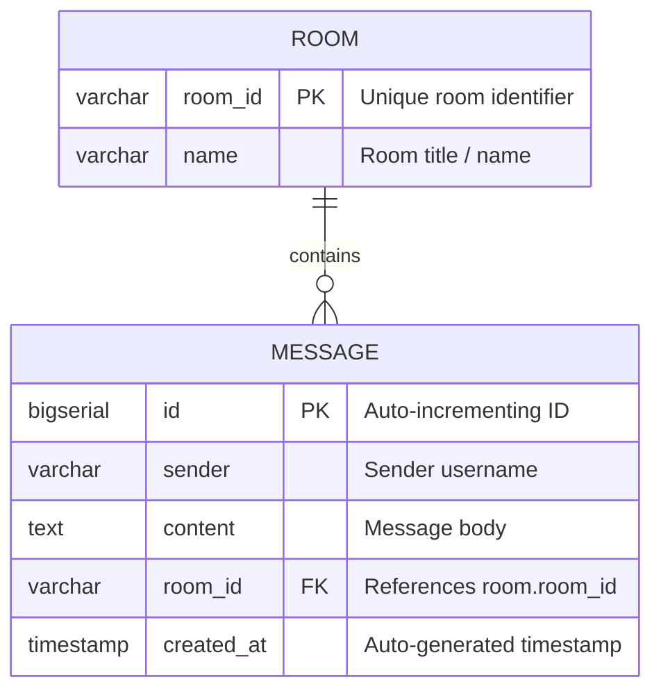
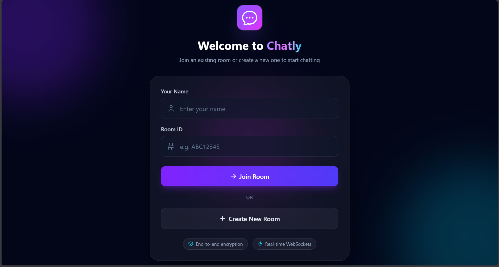
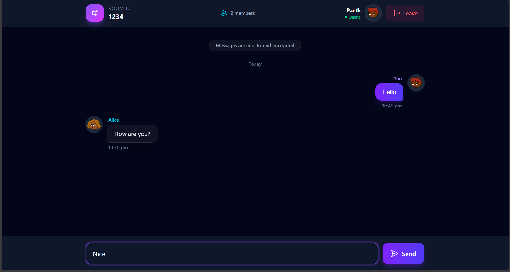

# Chatly — Real-Time Chat Application

A high-performance, full-stack real-time chat application built with **Spring Boot 4**, **WebSocket (STOMP / SockJS)**, **PostgreSQL**, and **React 19** powered by **Vite** and **Tailwind CSS**.

---

## Overview

**Chatly** enables seamless, low-latency room-based communication across distributed clients. Users can create distinct rooms or join existing rooms by ID, immediately accessing historical conversation logs and exchanging real-time messages over persistent WebSocket connections.

- **What it does:** Provides instant multi-user messaging within isolated chat rooms with full message history persistence.
- **Problem it solves:** Eliminates the overhead of HTTP polling for live communication by leveraging full-duplex WebSocket connections paired with reliable relational persistence.
- **Target Audience:** Developers, teams, and communities seeking a lightweight, instant-join collaborative room chat platform.
- **Core Value:** Clean separation of concerns between reactive frontend components, STOMP messaging brokers, and a structured REST/JPA backend.

---

## Demo

▶️ [Watch the Project Demo](screenshots/Demo.mp4)

---

## Features

### Room Management
- **Instant Room Creation:** Generate isolated chat rooms by providing a room identifier and display name.
- **Room Joining:** Join existing rooms by Room ID and fetch all previous chat history upon entering.
- **Room Validation:** Prevents duplicate room creations and validates room existence before joining.

### Real-Time Messaging & WebSockets
- **Full-Duplex Communication:** Powered by Spring WebSocket message broker with STOMP over SockJS fallback support.
- **Live Room Broadcasting:** Messages published to `/app/room/{roomId}` are automatically persisted and broadcast to all subscribers on `/topic/room/{roomId}`.
- **Automatic Connection Lifecycle:** Managed WebSocket connection hooks with clean teardown when leaving rooms or unmounting components.

### Message Persistence & History
- **Relational Storage:** Messages are saved in PostgreSQL with associated metadata (sender name, room reference, generated ID, timestamps).
- **Auto-Formatting & Chronological Grouping:** Frontend groups loaded chat history by calendar days (*Today*, *Yesterday*, or formatted dates) with AM/PM timestamps.

### User Interface & Experience
- **Modern Glassmorphic Dark UI:** Styled using Tailwind CSS with subtle gradients, custom avatars, and message bubbles differentiating self vs. peer messages.
- **Active Member Detection:** Dynamically tracks unique senders active within the current room session.
- **Interactive Feedback:** Real-time toast notifications for room creation, connection status, and error handling via `react-hot-toast`.
- **Keyboard Shortcuts:** Quick message dispatch on `Enter` key press.

---

## Tech Stack

| Category | Technology | Version |
| :--- | :--- | :--- |
| **Backend Framework** | Spring Boot | 4.1.0 |
| **Language (Backend)** | Java | 25 |
| **Data Access / ORM** | Spring Data JPA / Hibernate | Included in Spring Boot |
| **Database** | PostgreSQL | Latest / Compatible |
| **Real-Time Messaging** | Spring WebSocket, STOMP | Included in Spring Boot |
| **Frontend Framework** | React | 19.2.8 |
| **Build Tool** | Vite | 8.2.0 |
| **Styling** | Tailwind CSS | 4.3.3 |
| **Routing** | React Router DOM | 7.18.2 |
| **WebSocket Client** | SockJS Client & STOMP.js | `sockjs-client: ^1.6.1`, `stompjs: ^2.3.3` |
| **HTTP Client** | Axios | 1.19.0 |
| **Notifications** | React Hot Toast | 2.6.0 |

---

## Project Structure

```text
ChatApplication/
├── Backend/
│   ├── src/
│   │   ├── main/
│   │   │   ├── java/com/example/chatApplication/
│   │   │   │   ├── config/              # WebSocket and CORS configurations
│   │   │   │   │   ├── CorsConfig.java
│   │   │   │   │   └── WebsocketConfig.java
│   │   │   │   ├── controller/          # REST & WebSocket message controllers
│   │   │   │   │   ├── ChatController.java
│   │   │   │   │   └── RoomController.java
│   │   │   │   ├── dto/                 # Data transfer objects & API response models
│   │   │   │   │   ├── ApiResponse.java
│   │   │   │   │   ├── CreateRoomDto.java
│   │   │   │   │   ├── JoinRoomDto.java
│   │   │   │   │   ├── MessageDto.java
│   │   │   │   │   └── RoomDto.java
│   │   │   │   ├── entity/              # JPA Entities (Room, Message)
│   │   │   │   │   ├── Message.java
│   │   │   │   │   └── Room.java
│   │   │   │   ├── repository/          # Spring Data JPA repositories
│   │   │   │   │   ├── MessageRepository.java
│   │   │   │   │   └── RoomRepository.java
│   │   │   │   ├── service/             # Business logic layer interfaces & implementations
│   │   │   │   │   ├── impl/
│   │   │   │   │   │   ├── ChatServiceImpl.java
│   │   │   │   │   │   └── RoomServiceImpl.java
│   │   │   │   │   ├── ChatService.java
│   │   │   │   │   └── RoomService.java
│   │   │   │   └── ChatApplication.java # Spring Boot entry point
│   │   │   └── resources/
│   │   │       └── application.properties # Server, DB, & CORS configuration
│   ├── mvnw                             # Maven wrapper (Unix)
│   ├── mvnw.cmd                         # Maven wrapper (Windows)
│   └── pom.xml                          # Maven build & dependencies definition
│
└── Frontend/
    └── chat-frontend/
        ├── src/
        │   ├── components/              # Chat & Room views
        │   │   ├── ui/                  # Reusable UI elements (Buttons, Inputs, Bubbles)
        │   │   │   ├── ActionButton.jsx
        │   │   │   ├── Avatar.jsx
        │   │   │   ├── ChatInput.jsx
        │   │   │   ├── Divider.jsx
        │   │   │   ├── Icons.jsx
        │   │   │   ├── MessageBubble.jsx
        │   │   │   └── TextInput.jsx
        │   │   ├── ChatPage.jsx
        │   │   └── JoinCreateChat.jsx
        │   ├── config/                  # Axios base instance configuration
        │   │   └── AxiosHelper.js
        │   ├── context/                 # React Context for session & room state
        │   │   └── ChatContext.jsx
        │   ├── routes/                  # Application routing definitions
        │   │   └── AppRoutes.jsx
        │   ├── services/                # Backend API service integrations
        │   │   └── RoomService.js
        │   ├── App.jsx
        │   ├── index.css                # Tailwind CSS imports & global styles
        │   └── main.jsx                 # React root renderer with Router & Toast providers
        ├── package.json
        └── vite.config.js
```

---

## Installation & Setup

### Prerequisites
Make sure you have the following installed on your machine:
- **Java Development Kit (JDK):** Version 25 (or compatible LTS version)
- **Node.js:** v18.0.0 or higher
- **npm:** v9.0.0 or higher
- **PostgreSQL Database:** Running locally or accessible remotely
- **Git**

---

### 1. Clone the Repository
```bash
git clone https://github.com/parthshah-dev/Chat-Application.git
cd Chat-Application
```

---

### 2. Database Setup
Create a PostgreSQL database for the application:
```sql
CREATE DATABASE chat_app_db;
```

---

### 3. Environment Variables Configuration

The backend reads configuration parameters either from environment variables or a `.env` file located in the project root or `Backend/` directory.

Create a `.env` file inside the `Backend` directory (`Backend/.env`):

```env
# Database Credentials
SPRING_DATASOURCE_URL=jdbc:postgresql://localhost:5432/chat_app_db
SPRING_DATASOURCE_USERNAME=your_postgres_username
SPRING_DATASOURCE_PASSWORD=your_postgres_password

# Frontend URL for CORS mapping
FRONTEND_URL=http://localhost:5173
```

> **Security Notice:** Never commit actual `.env` files or database passwords to public version control.

---

### 4. Backend Setup & Run

1. Navigate to the `Backend` directory:
   ```bash
   cd Backend
   ```
2. Build and run the Spring Boot application using Maven:
   - **Linux / macOS:**
     ```bash
     ./mvnw spring-boot:run
     ```
   - **Windows:**
     ```cmd
     mvnw.cmd spring-boot:run
     ```
3. The backend will start on **`http://localhost:8080/api`**.

---

### 5. Frontend Setup & Run

1. Open a new terminal and navigate to the frontend directory:
   ```bash
   cd Frontend/chat-frontend
   ```
2. Install dependencies:
   ```bash
   npm install
   ```
3. Start the Vite development server:
   ```bash
   npm run dev
   ```
4. Access the application in your browser at **`http://localhost:5173`**.

---

## API Documentation

The backend exposes a servlet context path at `/api`.

### REST Endpoints

| Method | Endpoint | Description | Request Body | Response |
| :--- | :--- | :--- | :--- | :--- |
| `POST` | `/api/rooms` | Creates a new chat room | `{ "name": "General", "roomId": "ROOM101" }` | `ApiResponse<RoomDto>` |
| `GET` | `/api/rooms/{roomId}` | Retrieves room details and existing messages | *None* | `ApiResponse<JoinRoomDto>` |
| `GET` | `/api/rooms/{roomId}/messages` | Fetches all messages for a specific room | *None* | `ApiResponse<List<MessageDto>>` |

---

### WebSocket & STOMP Protocol

| Protocol Channel | Endpoint / Destination | Description |
| :--- | :--- | :--- |
| **STOMP Endpoint** | `ws://localhost:8080/api/chat` (with SockJS fallback) | WebSocket connection handshake endpoint. |
| **Publish (Send)** | `/app/room/{roomId}` | Destination where clients send new messages. |
| **Subscribe (Listen)** | `/topic/room/{roomId}` | Topic where subscribers receive live broadcasted messages. |

**Message Payload Example:**
```json
{
  "sender": "Alice",
  "content": "Hello everyone!",
  "timestamp": "2026-08-22T17:00:00.000Z"
}
```

---

## Database Schema



- **`room` Table:** Primary key `room_id` (`String`). Represents isolated chat channels.
- **`message` Table:** Foreign key `room_id` mapped via `@ManyToOne` relationship with `CascadeType.ALL` and orphan removal enabled on the `Room` entity.

---

## Security & Network Policies

- **CORS Configuration:** Spring MVC `CorsConfig` is configured to allow requests from the frontend origin specified in `FRONTEND_URL` (`http://localhost:5173` by default) with credentials enabled across `GET`, `POST`, `PUT`, `DELETE`, `PATCH`, and `OPTIONS` methods.
- **WebSocket Origins:** SockJS STOMP endpoint allows configured origin patterns (`*`) to ensure cross-origin client interoperability during development.

---

## Key Application Flows

### 1. Creating and Joining a Room
1. User enters their display name and a unique Room ID on the landing page.
2. Clicking **"Create New Room"** sends `POST /api/rooms`. On success, state is saved to `ChatContext` and the user is redirected to `/chat`.
3. Clicking **"Join Room"** triggers `GET /api/rooms/{roomId}` to confirm existence and fetch prior messages before navigating.

### 2. Live Chat Flow
```text
User Types Message ──> ChatInput Component
                           │
                           ▼
                    STOMP Client.send('/app/room/{roomId}')
                           │
                           ▼
              ChatController (@MessageMapping)
                           │
                           ▼
               ChatServiceImpl.sendMessage()
              ┌────────────┴────────────┐
              ▼                         ▼
   Persist to PostgreSQL       Broadcast via SimpMessagingTemplate
   via MessageRepository       to '/topic/room/{roomId}'
                                        │
                                        ▼
                           All Subscribed React Clients
                                        │
                                        ▼
                           UI updates MessageBubble list
```

---

## Screenshots

| Welcome / Join Room Screen | Live Chat Room Interface |
| :---: | :---: |
|  |  |

---

## Contributing

Contributions, bug reports, and feature requests are welcome!

1. Fork the repository.
2. Create a feature branch:
   ```bash
   git checkout -b feature/YourFeatureName
   ```
3. Commit your changes:
   ```bash
   git commit -m "Add: Your feature description"
   ```
4. Push to your branch:
   ```bash
   git push origin feature/YourFeatureName
   ```
5. Open a Pull Request.

---

## License

This project currently has no specified open-source license. All rights reserved by the repository owner.

---

## Author

- **GitHub:** [@parthshah-dev](https://github.com/parthshah-dev)

